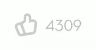
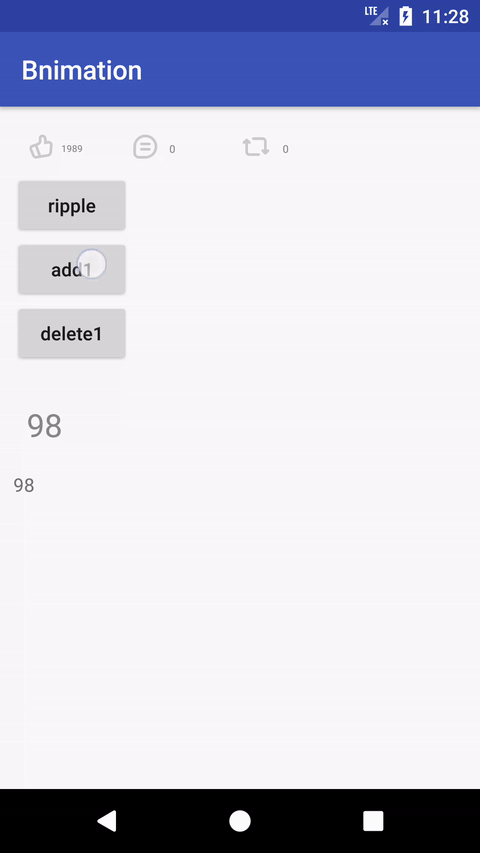
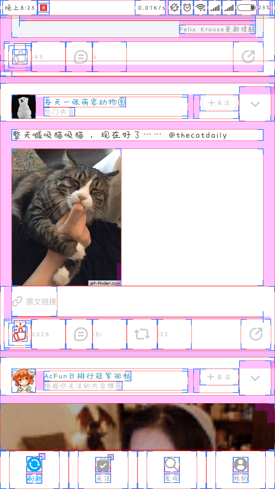
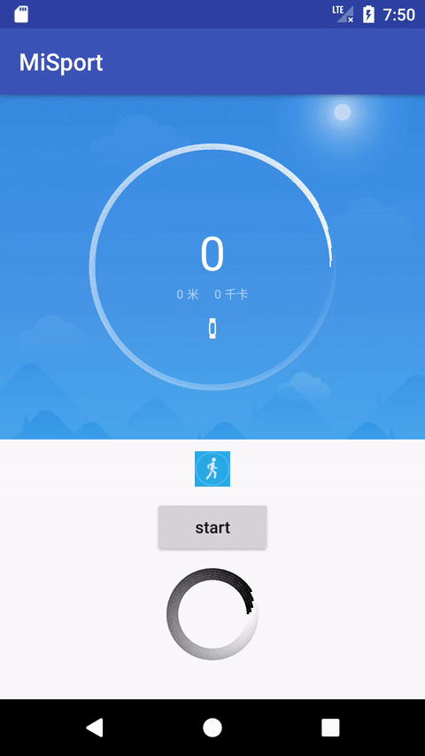
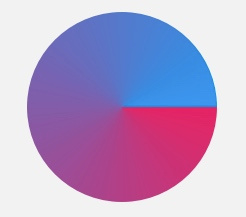
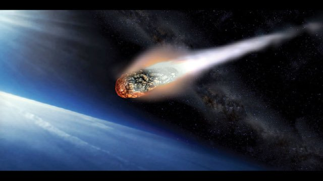
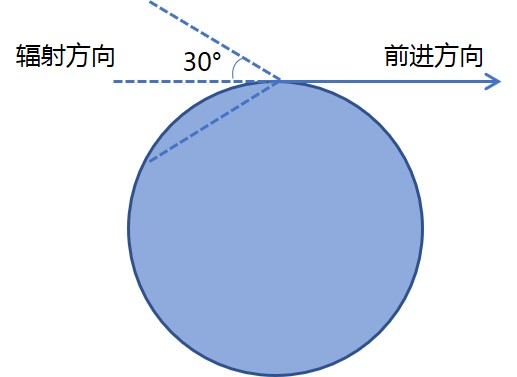

# Bnimation

本项目来源于 [HenCoder「仿写酷界面」征稿 ](http://mp.weixin.qq.com/s/T5tymYD1jhvxHY8F51TV5Q)

现阶段实现了模仿即刻点赞效果以及数字跳动增长，小米运动首页烟花转圈圈(•̀⌄•́)效果。

### 即刻

即刻的点赞效果




下面是我实现的效果（最下为 `TextView` 自带的展示数字效果）



主要使用了 `PropertyValuesHolder` 和 `ObjectAnimator` 来编写动画。点赞效果可以分为手势图标的缩小放大（1.0->0.8->1.0，符合重力按下的效果），水纹图案的扩散并逐渐透明，手势上的 'shining' 图标的放大。通过 `AnimatorSet` 控制这三种动画的播放顺序。数字跳动效果通过比较新数字与旧数字之间的差异，从左侧开始第一个不同的数字以及后面的数字都需要跳动。如当前显示为 99，99+1=100，99 与 100 从第一位开始就不同，所以需要整体滚动。而 909+1=910 这种情况，只需要从第 2 位开始滚动即可。

滚动效果的实现主要使用 

```java
class Paint {
  ...
    public void drawText(@NonNull String text, int start, int end, float x, float y,
                         @NonNull Paint paint) {
      super.drawText(text, start, end, x, y, paint);
    }
  
}

```

这个函数。坐标 `y` 根据 `view` 的高度与字体的 `ascent` 和 `descent` 属性可以得到纵向中间的位置。坐标 `x` 使用 `Paint` 类的 `getTextWidths()` 获得每一位数字的宽度，每次累加即可（注意，0~9 每个数字的宽度不完全相等）。

图标来源于[即刻 App](https://www.ruguoapp.com/) 反编译后的资源包，布局也使用了即刻的布局（还是有些复杂的）




### 小米运动

小米运动效果


上述 Gif 图中前半段是一个烟花转圈圈的效果，表示正在连接到运动设备，后烟花渐隐，出现计时的圆圈。烟花转圈的效果比较难实现，所以下文主要讲这个部分的实现。

下面是我实现的效果：最下面是 `ProgressBar` 的展示。



我将这个动画分为两部分： `ProgressBar` 就是按钮下方展示的，还有烟花效果 `Comet` 。

`ProgressBar` 部分使用 `Canvas` + `Path` 完成，可以看到是 5 个圆圈按照某种梯度依次包含。每层圆圈使用 `SweepGradient`   实现了颜色渐变。这里面有个技巧：`SweepGradient` 颜色渐变如下分布



其构造方法不提供初始的旋转角度，需要使用 `canvas.rotate()` 方法对画布进行旋转。当然，每次操作前记得 `canvas.save()` 操作后 `canvas.restore()` 

烟花的效果参考了这篇文章[为你的EditText添加一个烟花效果](http://www.jianshu.com/p/a001192aaa4b) ，`Comet` 类存储了所有的尘埃 `Dust` 实例，在每个位置都会诞生出 `Dust` 而 `Dust ` 中包含了在此位置辐射的所有 `Element` 。

值得注意的是模仿的是彗星运行的效果，所以每一处位置上辐射的 `Element` 范围在与前进方向相反的并且-30~30度内，大概就是这样的。



有点夸张了



将 `ProgressBar` 与 `Comet` 分开，由 `ProgressBar` 的滚动动画 `ObjectAnimator` 来驱动 `Comet` 产生 `Dust` 和执行 `Dust` 辐射效果。

图片来源于 小米运动 App 反编译后的资源包， [HenCoder Android 开发进阶: 自定义 View 1-2 Paint 详解](http://hencoder.com/ui-1-2/) 关于 `SweepGradient` 的描述图片。

做完这个项目之后突然惊觉：使用 `canvas` 画出一个圆圈，并在某个位置固定产生 `Dust `  并执行辐射效果，然后对 `canvas` 整体旋转不就得了。。。